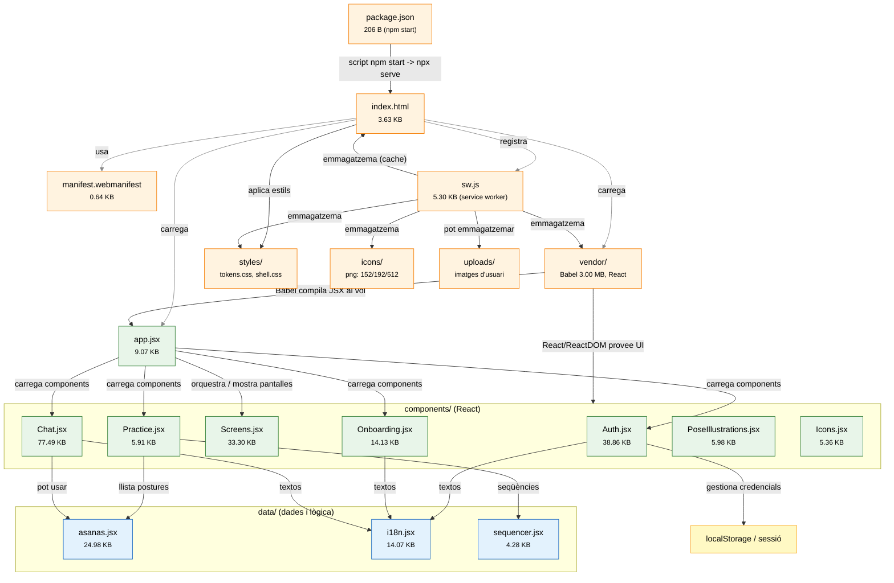

# El Bosc · Mapa conceptual (diagrama amb connexions i colors)

> Aquest fitxer conté un diagrama Mermaid amb connexions entre els fitxers principals del projecte. Obre'l amb un visor que suporti Mermaid (VS Code amb extensió Mermaid, o https://mermaid.live/).

## Diagrama (Mermaid)

## Llegenda (colors)
- Nodes taronja clar (arrel / recursos) — fitxers que serveixen l'aplicació i recursos PWA (index.html, sw.js, manifest, vendor, styles, icons). 
- Nodes verd clar (components) — components React que mostren la interfície (Auth, Chat, Practice...)
- Nodes blau clar (data) — fitxers amb dades i lògica no UI (asanas, i18n, sequencer)
- Node groc (localStorage) — on es guarda sessió/localStorage a l'execució

## Notes
- Obre aquest fitxer en un visor Mermaid per veure el diagrama amb colors i connexions interactives.
- Si vols puc generar també una imatge SVG del diagrama i pujar-la al repo perquè es vegi directament al navegador.
